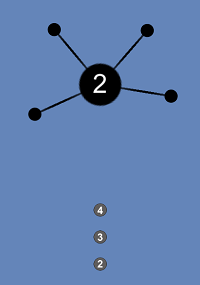
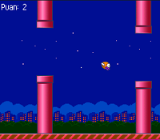
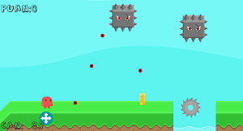
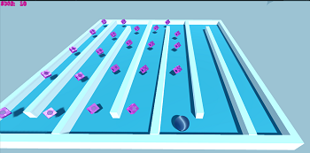
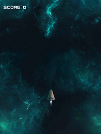
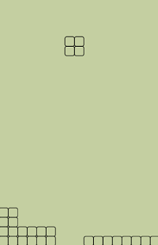

# Unity Learn Projects

All of these projects have been coded and created by me in Unity to improve my Unity skills. (with the help of various tutorials)

- ## 3D Korku Oyunu (In Progress...)
- ## AA (Replica)

- ## Flappy Bird (Replica)

- ## Red Java

- ## Roll a Ball

- ## Space Shooter

- ## Tetris (Replica)

## ʕ•㉨•ʔ